# Jet Gun Guide

The Jet Gun is built in the bar in the town.

## Chassis locations
In the tunnel on the walkway.\
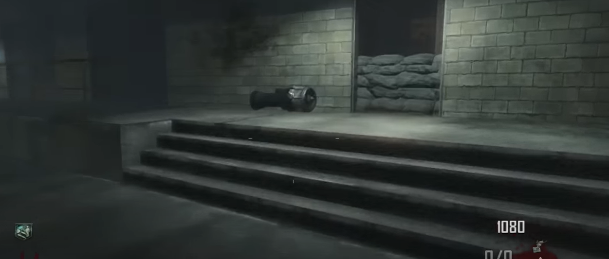\
\
In the tunnel by this garage door:\
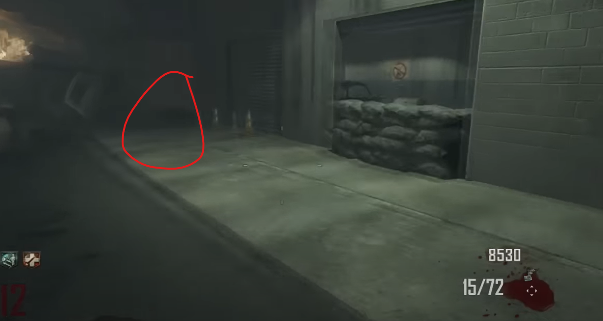\
\
In this pile of cars in the tunnel:\
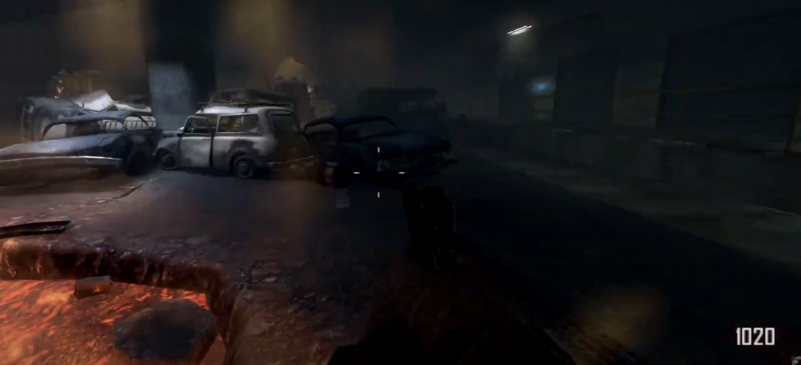

## Gagues locations
In the shack on the way between the power station and town on the left at the base of the fireplace.\
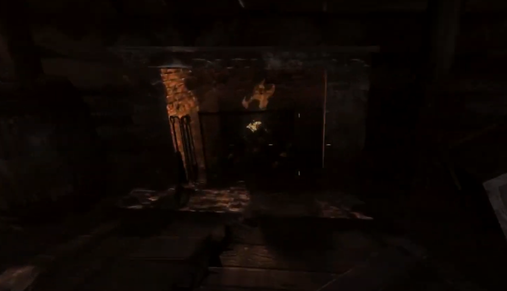\
\
On the bench next to the barrel.\
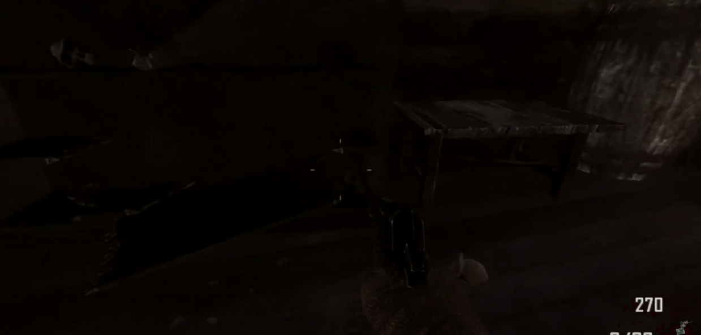\
\
On the bed frame.\
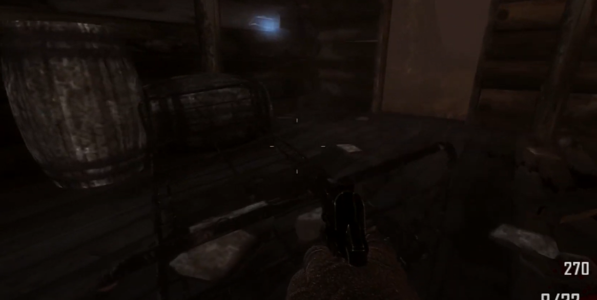

## Wires locations
On this generator above the power station lava pit:\
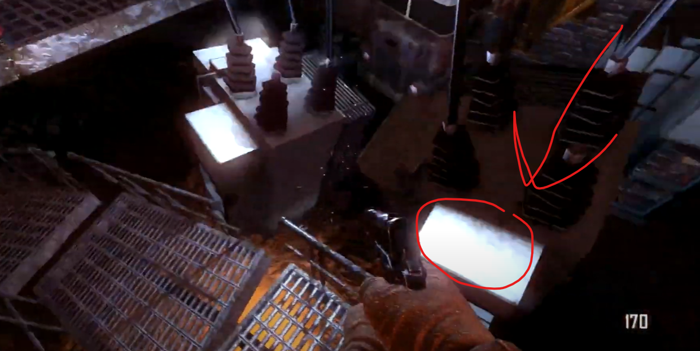\
\
On a barrel in the corner on the walk back from the power station lava pit.\
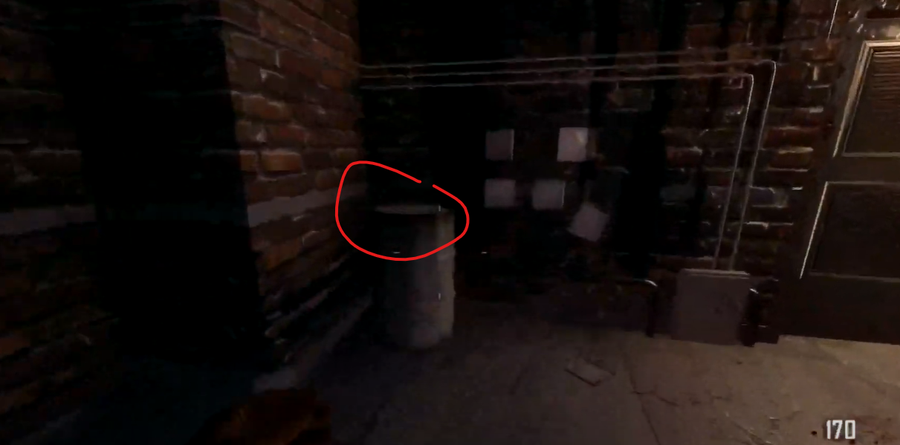\
\
At the edge above the power station lava pit.\
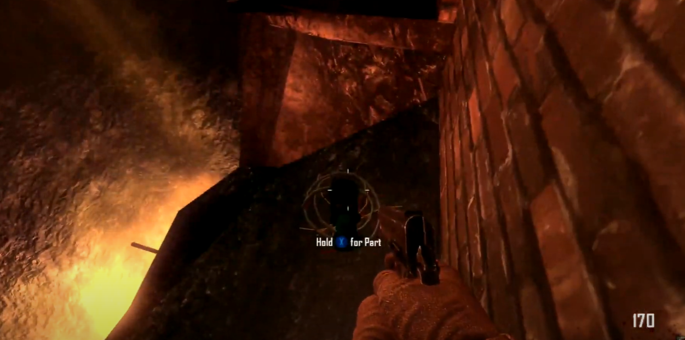

## Handbrake locations
On this shelve in Nacht Der Untoten:\
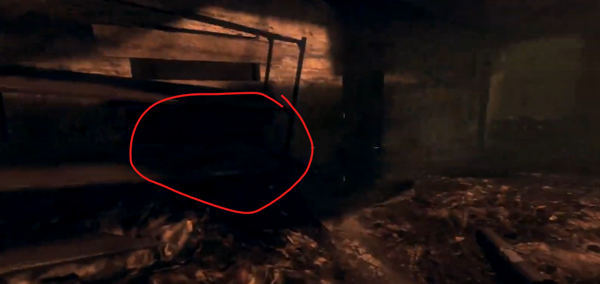\
\
On the spiral stairs in Nacht Der Untoten.\
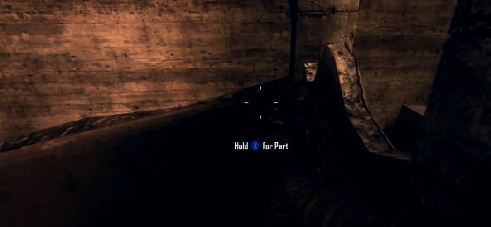\
\
On this filling cabinet in Nacht Der Untoten:\
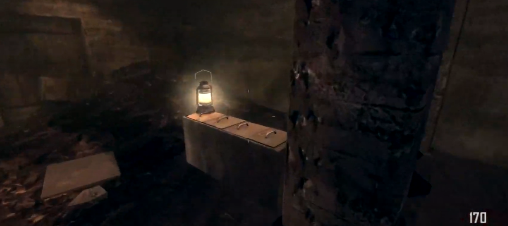
