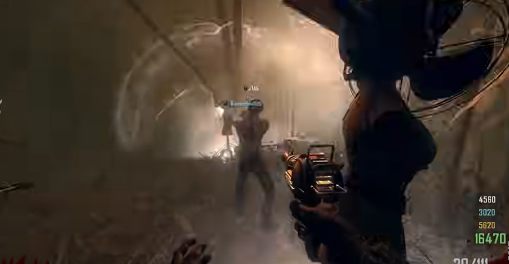
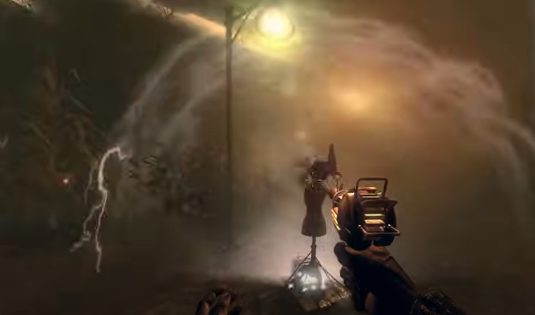

# Tranzit Maxis Main Quest Guide

## Note:
* Need at least 2 players
* Everyone must have a turbine
* Dont forget about the navcard
* One player must get emp grenades from the box
* The best way to get the Avogadro to spawn in is by waiting for theentire skybox to be shocking with electricity, not just part of the skybox.

## Steps

### Step 1:
Turn on power.

### Step 2:
Wait for facility power to be restored. Turn power off.

### Step 3:
Go into the back of the cornfield. Get the Avogadro to spawn in. Place two turbines on either side of the nav card table.\
\
\
\
Wait for Maxis' quote, throw the emp grenade at the Avogadro once he is under the pylon but opposite the turbines. The emp should be far enough away from the turbines to not affect them but close enough to the Avogadro to affect him. He will fly into the sky and Maxis will have another quote.

### Step 4:
Place two more turbines at any of the teleportation roadlights.\
\
\
\
They will turn green and then shine in orange.

### Step 5:
g-frikin-g
