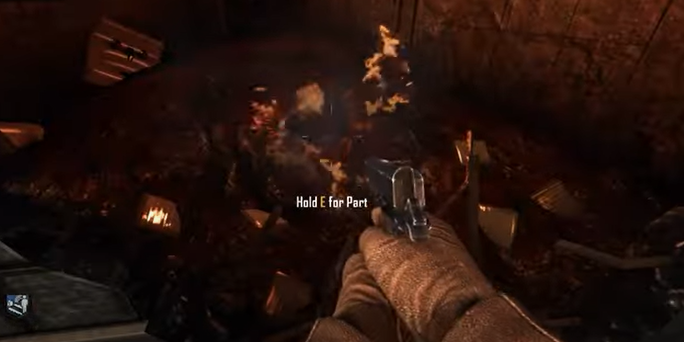
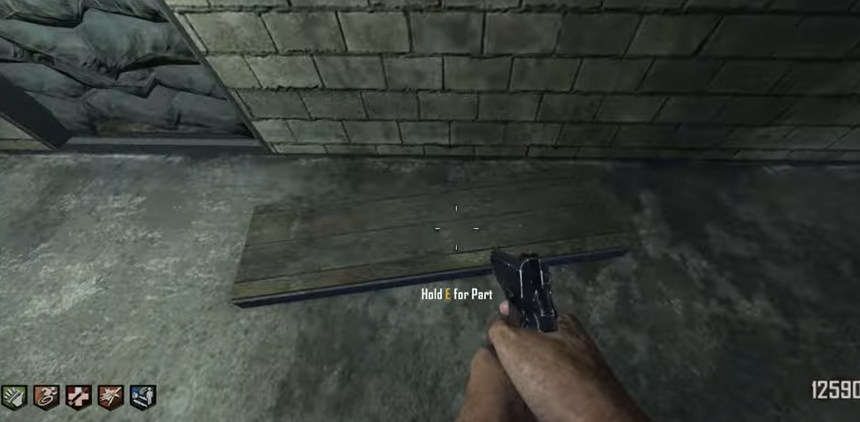
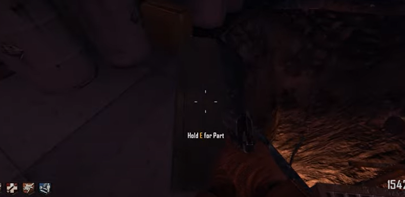
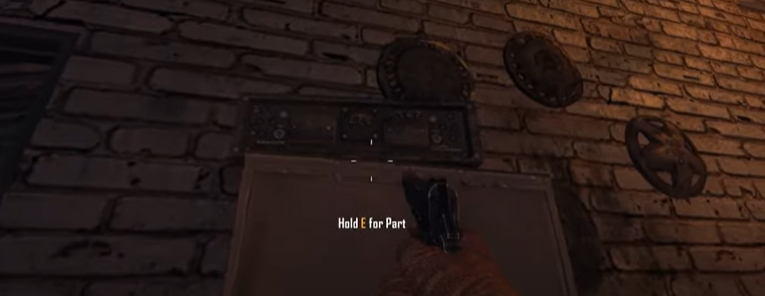
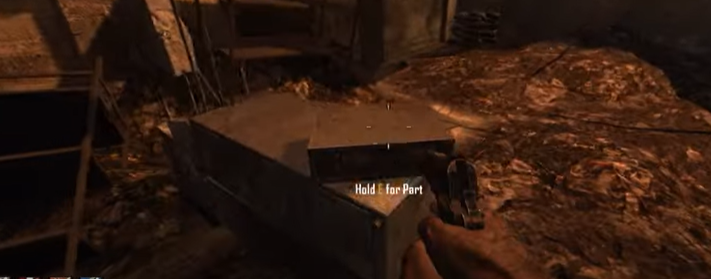
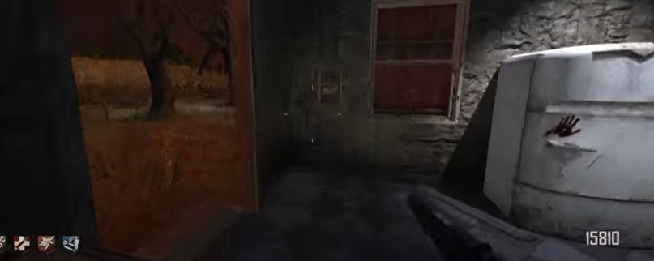
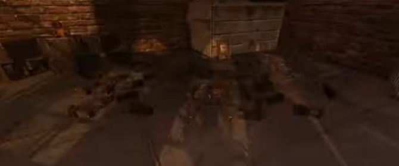

# Tranzit Nav Card Guide

## Note:
* Use nav card from buried on the nav card table in Tranzit

## Nav card location:
For nav card table in Die Rise.\
\
It is in the bus depot, around the corner of the building.

## Nav card table parts

### Part 1 location:
Inside the destroyed wall of the bus depot.\
\

### Part 2 locations:
In the tunnel to the diner on the side of the road:\
\
\
In the power station by the lava pit:\

### Part 3 locations:
In the gas station on a cabinet:\
\
\
In Nacht Der Untoten:\

### Part 4 locations:
In the farm house next to the fridge:\
\
\
In town by a dumpster:\

## Build location:
Build the nav card table under the pylon in the cornfield.
